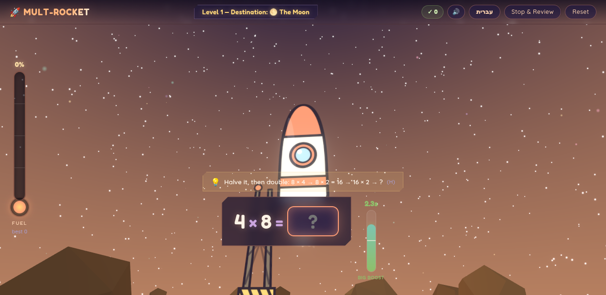
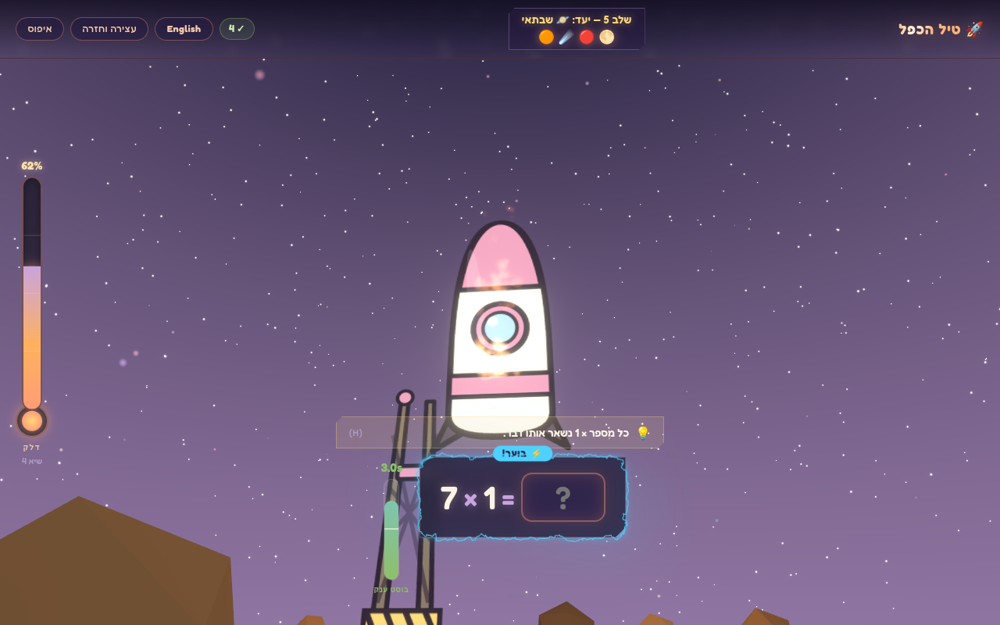
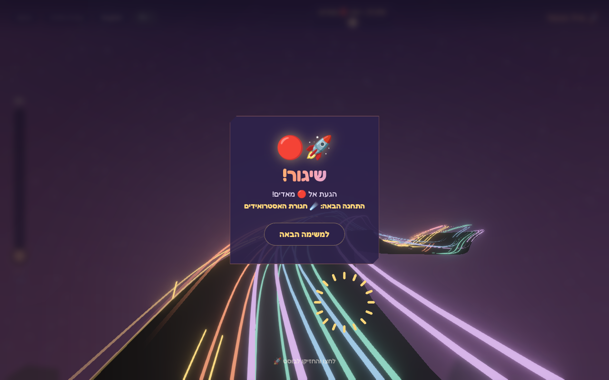
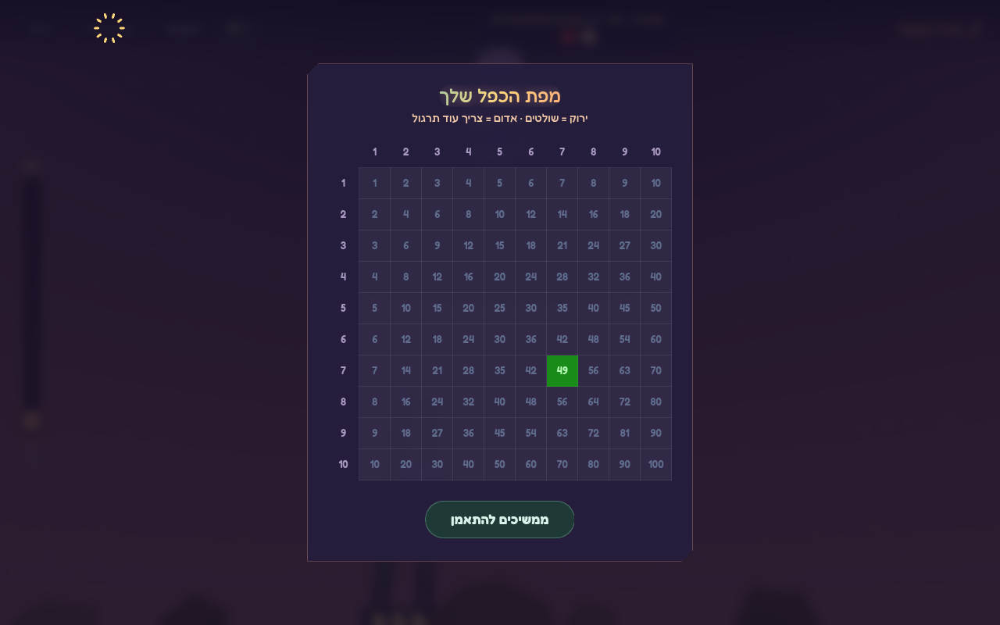
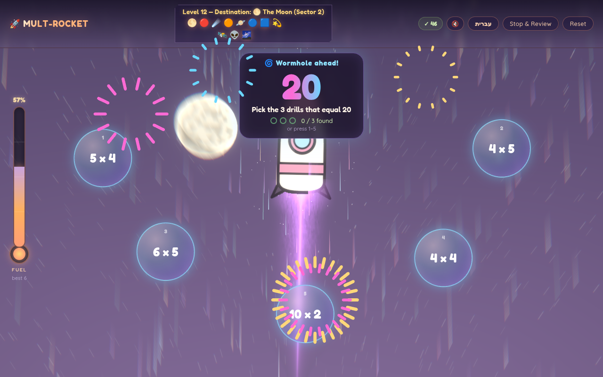
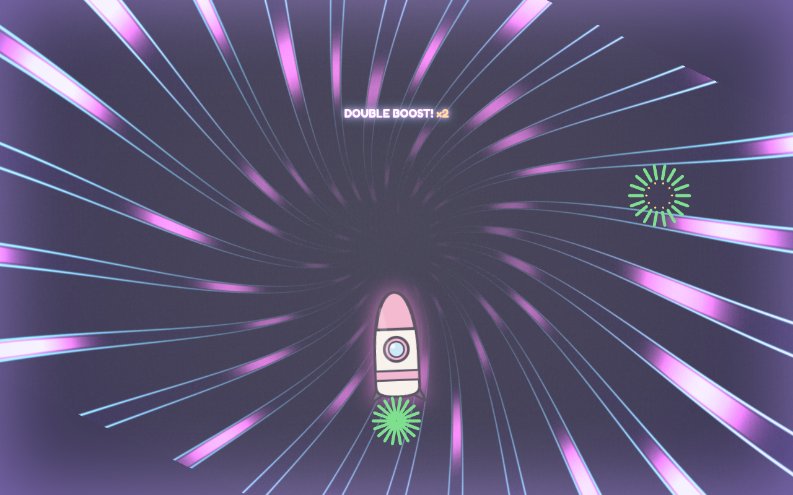
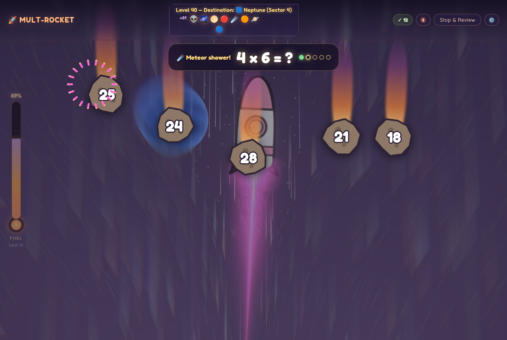
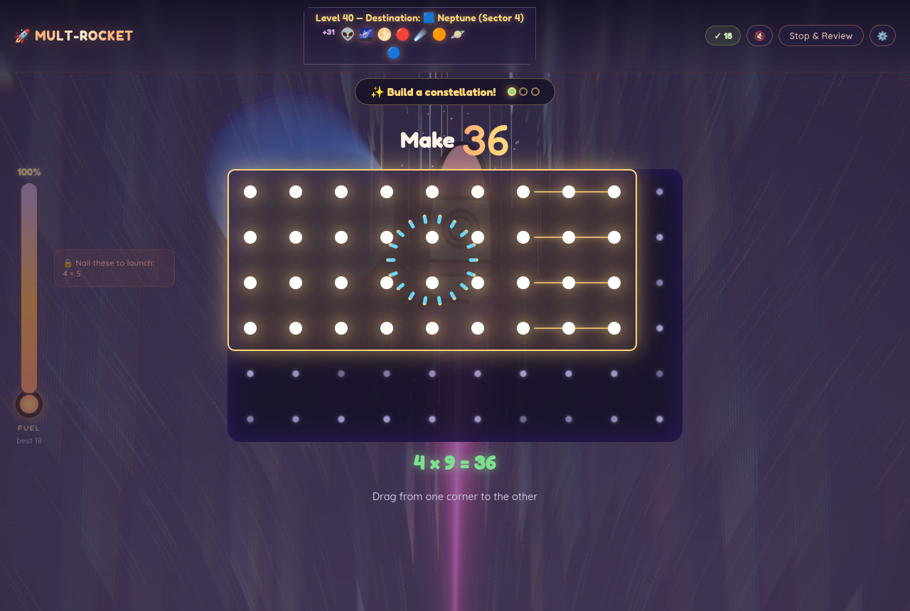
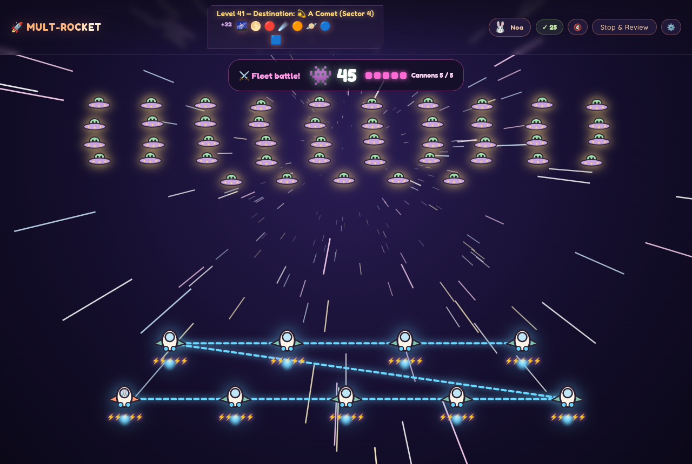
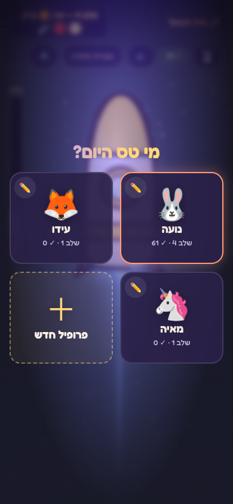

# 🚀 Multiplication Rocket

A space-rocket game for practicing the multiplication table (1–10), in **English and Hebrew**.
The rocket is always flying, under northern-lights curtains that change color every level. Every correct answer fuels it and speeds it up, and a streak of
correct answers makes it go faster still: stars stretch into streaks, the screen motion-blurs,
and the engine plume grows hotter. A wrong answer makes it brake and slow down. Fill the tank to
reach the destination planet, which grows in the sky as you get closer, and warp to the next one.



## Play in your browser

**[idanbenzvi.github.io/multiplication-rocket](https://idanbenzvi.github.io/multiplication-rocket/)**. Nothing to install. Works on computers and tablets.

## Download & play (no installation needed)

Grab the file for your computer from the **[latest release](https://github.com/idanbenzvi/multiplication-rocket/releases/latest)**:

| Computer | File | How to open |
|---|---|---|
| **Windows** | `Multiplication-Rocket-…-win-x64.exe` | Double-click it. If Windows shows *"Windows protected your PC"*, click **More info → Run anyway** (the app isn't code-signed). |
| **Mac** | `Multiplication-Rocket-…-mac-universal.dmg` | Open the `.dmg` and drag the app to Applications. The first time, **right-click the app → Open → Open** (the app isn't notarized by Apple). |
| **Linux** | `Multiplication-Rocket-…-linux-x86_64.AppImage` | Right-click → Properties → allow executing as a program, then double-click. |

Progress is saved automatically on the computer.

Leaving the game (another tab or app, minimizing, locking the tablet) pauses it: music and sounds stop, the answer timer and any bonus round freeze, and a tap or key press carries on exactly where you left off.

### Tablets and phones

The browser version is made for touch. Answers are multiple choice by default (tap one of four),
or switch **⚙️ Settings → Answer by → Typing** for a big on-screen number pad. In **⚙️ Settings**
you can also choose when a typed answer is checked: **right away** (as soon as all its digits are
in) or **when you tap the screen** (or press ✓). On a computer, typed answers always wait for
**Enter**, so a typo can be fixed first. On Android, right answers give a revving buzz and
mistakes a thump; this can be switched off in Settings. iPhone and iPad browsers don't support
vibration. To make it feel like an app, use **Share → Add to Home Screen** (iPad/iPhone) or
**⋮ → Add to Home screen** (Android). It then opens full-screen with its own icon.

## How it works

- **Fuel = speed × correctness.** A correct answer adds fuel. A fast answer (green **BIG BOOST** zone) adds much more. A wrong answer empties the tank, unless it was already full.
- **No skipping facts you still miss.** Even with a full tank, the rocket won't launch while a recently missed fact is still unresolved. The game keeps asking it until it's fixed.
- **Wrong answers teach.** A miss shows the fact as a grid (*x rows of y*) before moving on.
- **Strategy hints** (press **H**) break hard facts into easy steps, like `7 × 9 → 7 × 10 − 7`, and leave the last step to the player.
- **Mastery map.** *Stop & Review* shows a 10×10 heatmap of what's mastered (green) and what needs practice (red). It can also open by itself after 5 mistakes (off by default, in ⚙️ Settings). With a mouse, just hover over *Stop & Review* for a quick read-only peek at the map, with a mastered / to-practice / not-tried-yet count, without pausing the game.
- **On fire 🔥.** Three in a row lights up an electric border around the question, and it gets wilder the longer the streak lasts.
- **Bonus rounds.** Every 6th question becomes a bonus round, rotating through five kinds:
  - **Wormhole 🌀.** A target number and five floating drills. Pick the three that equal the target (tap them, or press 1–5) to open a wormhole, fly through it, and get a **double boost** of fuel. Two wrong picks and the wormhole closes, with no penalty. The correct drills always include at least two different factor pairs, and sometimes a swapped order (3 × 4 and 4 × 3), so it also teaches that order doesn't matter.
  - **Meteor Shower ☄️.** A drill shows at the top and numbered meteors fall across the sky. Tap the one with the answer before it burns up. A wrong tap cracks that meteor and makes the right one glow. Each hit in a row makes the next meteors fall faster. Five drills per round, each first-try hit adds fuel, and the answers count toward the mastery map.
  - **Build-a-Constellation ✨.** Make a number by dragging across a grid of stars to frame a rectangle. A live label reads "3 rows × 4 = 12", and the right size lights up as a constellation. It shows what multiplication *is* (rows times columns) and that one number can be built different ways. After two misses, a dotted outline hints at an answer.
  - **Fleet Battle ⚔️.** The view warps to forward-looking and an enemy fleet appears on the horizon, say 👾 24. Fly around (← ↑ → ↓ or drag) to collect the laser cannons, here 4. Then: "Each ship carries 4 cannons. How many ships do we need for 24 enemies?" Answer 6 and six ships fly in and circle your ship faster and faster inside a blazing ring while a power meter charges. Then one huge beam fires, flinging every enemy away in all directions, with one flying straight at you. Only the exact answer wins. Too few ships leave enemies standing ("5 ships × 4 = 20: 4 enemies left!"), and too many overload the beam ("7 ships × 4 = 28: 4 cannons too many!"). After three tries the right fleet is shown doing it. It's a first taste of division: the missing factor.
  - **Stranded Fleet 🛸.** The ship jumps to lightspeed, banking and rolling as if the pilot is fighting the controls. Stranded, out-of-fuel ships fly in one by one, each projecting a hologram drill that hides the same number: `[ ] × 4 = 28`, `[ ] × 9 = 63`, `[ ] × 2 = 14`… Spot the number they all share (7) to power them up: your ship sends an energy pulse rippling through space (a WebGL shader that bends the starfield), each ship powers up as the ring reaches it, and the whole fleet jumps to lightspeed. The sooner you guess, the bigger the fuel bonus (3× with one ship showing, down to 1× with all five). A wrong guess makes every ship check it ("6 × 4 = 24 ✗ 28"), so you can see why it doesn't fit.
- **Celebrations that grow.** The praise word, spark bursts and chime all escalate with the streak (the chime climbs higher with every answer in a row). Every 5 in a row sets off fireworks and a banner.

| Hebrew + streak | Launch | Mastery map |
|---|---|---|
|  |  |  |

| Wormhole challenge | Flying through |
|---|---|
|  |  |

| Meteor Shower | Build-a-Constellation | Fleet Battle |
|---|---|---|
|  |  |  |

## Deep Space Academy 🪐 (hidden)

**Tap the rocket's window three times quickly** to warp into the Deep Space Academy. Until a pilot has found it, their window shimmers (a pulsing halo, a glint sweeping across the glass) to invite the taps. The Academy is a calm
screen that teaches multiplication from the ground up, for a child who has never met "×". The
game waits while it's open. Every step can be read aloud (🔊) in English or Hebrew, so
pre-readers can follow.

The lessons follow the order the research on early multiplication supports:

1. **Equal groups.** Buses of 4 aliens; tap to count them all. Children's own starting model is
   equal groups and counting ([Mulligan & Mitchelmore, *Young children's intuitive models of
   multiplication and division*](https://researchers.mq.edu.au/en/publications/young-childrens-intuitive-models-of-multiplication-and-division-2/);
   [Mathematics Education Research Journal, 2022](https://link.springer.com/10.1007/s13394-022-00413-1)).
2. **Adding the same number:** `4 + 4 + 4`, then skip counting on a number line. Repeated
   addition is children's most common intuitive model, so it's the bridge, not the destination.
3. **The × sign** as a shortcut for "groups of": the first number is how many groups, the second
   is how many in each.
4. **Arrays.** The aliens park in rows; each row is an equal group, and the whole array is a group
   of groups ([Barmby, Harries, Higgins & Suggate 2009, *The array representation and primary
   children's understanding and reasoning in multiplication*](https://dro.dur.ac.uk/5458);
   [Outhred, PME28](https://emis.univie.ac.at/proceedings/PME28/RR/RR018_Outhred.pdf)).
5. **Turn it around.** Rotating the array shows `3 × 4 = 4 × 3`: a reasoning strategy that halves
   what has to be learned, in line with strategy-based fact fluency rather than rote drilling
   ([Baroody's phases, via NCTM/Georgia Standards](https://www.georgiastandards.org/Georgia-Standards/Documents/3rd-Math-Fluency-NCTM-2015.pdf);
   [Wisconsin DPI fact-fluency progression](https://dpi.wi.gov/sites/default/files/imce/math/files/Fact_Fluency_Infographic_-_FINAL.pdf)).
6. **Your turn**, with support that fades: build 2 groups of 3 with buttons, then read a dot
   picture, then a symbols-only problem with an optional "show me". This is the
   concrete → representational → abstract sequence
   ([meta-analytic review of CRA, University of Kentucky](https://scholars.uky.edu/en/publications/a-meta-analytic-review-of-the-concrete-representational-abstract-/)).

## Pilot profiles (siblings)

Each child can have their own pilot: a name plus an animal avatar (🐶🐱🐰🦊🐻🐼🐨🐯🦁🐮🐷🐸🐵🐧🦄🐙).
Every pilot has separate progress: level, fuel, streaks and practice map. With more than one
pilot, the game opens on **"Who's flying today?"**. Switch pilots, add a new one, or edit or delete
one from the avatar button in the top bar. **Reset** in Settings only resets the current pilot.
Everything is stored on the device; nothing is sent anywhere. Progress from before profiles existed
is kept and becomes the first pilot.

The pilot's animal also rides in the rocket's porthole.

Answer mode, language and sound are shared by everyone on the device.



## Hebrew

Click **עברית** in the top bar. The layout switches to right-to-left while equations and hint
formulas stay left-to-right, as in Israeli school workbooks. All text lives in
[`src/i18n/strings.ts`](src/i18n/strings.ts).

## Sound

The theme song, *Gliding Past the Rim*, was made for this game with Google Gemini. Click 🔊 in the
top bar for separate **music** and **sound-effect** volume sliders (all the way down = off). The
sound effects are synthesized in the browser with Web Audio, so there are no sample files.

## Development

Requires [Node.js](https://nodejs.org) 20+.

```bash
npm install
npm run dev      # play in the browser with hot reload
npm run app      # run as a desktop app (Electron)
npm run dist     # build a desktop executable for this OS into release/
```

Built with React, TypeScript, Vite, [react-three-fiber](https://github.com/pmndrs/react-three-fiber)
for the 3D launch scene, [zustand](https://github.com/pmndrs/zustand) for state, and animated
components adapted from [React Bits](https://reactbits.dev) (Hyperspeed, LightTunnel,
Aurora, ElectricBorder, ClickSpark, CountUp, ShinyText, GradientText, StarBorder) in
[`src/components/reactbits/`](src/components/reactbits/). The engine plume is React Bits'
LaserFlow shader, ported to run inside the 3D scene
([`laserFlowShader.ts`](src/components/scene/laserFlowShader.ts)). Flight speed is modeled in
[`src/game/flight.ts`](src/game/flight.ts).

### Dev mode

Add `?devmode=true` to the URL, for example `npm run dev` then http://localhost:5173/?devmode=true, or
https://idanbenzvi.github.io/multiplication-rocket/?devmode=true. A small **DEV** panel appears
in the corner. Its rows can be tapped on tablets, or use the shortcuts:

| Shortcut | Does |
|---|---|
| Shift+W | Wormhole challenge |
| Shift+M | Meteor Shower |
| Shift+C | Build-a-Constellation |
| Shift+B | Fleet Battle |
| Shift+S | Stranded Fleet |
| Shift+K | Fleet Battle: collect all cannons |
| Shift+G | Answer the current Stranded Fleet / Fleet Battle correctly |
| Shift+L | Complete the level (launch warp) |
| Shift+F | Fuel to 95% |
| Shift+A | Deep Space Academy |
| Shift+P | Practice map |

The panel's last line shows whether the Stranded Fleet energy pulse is running as a WebGL shader or has fallen back to CSS rings (with the reason), which is useful if the pulse looks wrong on a device.

Dev actions affect the current pilot's real saved progress (for example Shift+L really levels up),
so use a separate test pilot.

### Releasing a new version

Pushing a version tag builds Windows, Mac and Linux executables on GitHub Actions and attaches
them to a GitHub Release:

```bash
npm version patch        # bumps package.json, e.g. 1.0.0 -> 1.0.1, and tags v1.0.1
git push --follow-tags
```

## License

Code: [MIT](LICENSE). The app icon uses the 🚀 from [Noto Color Emoji](https://github.com/googlefonts/noto-emoji) (OFL).
